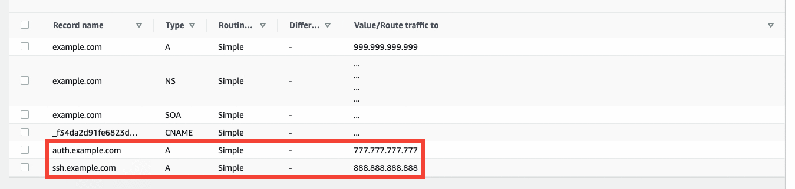
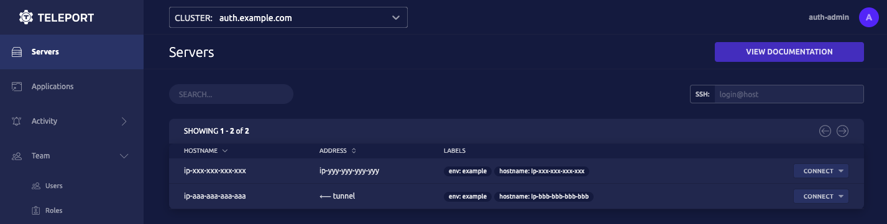

# Getting Started

Teleport Server Access provides full SSH capabilities out-of-the-box:

1. Teleport's `tsh` combines support for SSH and SCP in one convenient local command-line tool.
2. Each Teleport node can be configured into SSH mode (Teleport Node) and run as an enhanced SSH server.

The steps below involve:

1. Create and supplement a Teleport Auth node cluster with a Teleport SSH Node.
2. Using `tsh` to SSH into the cluster without external SSH dependencies.
3. Inspecting the cluster using advanced `tsh` features.

## Prerequisites

- A Linux environment (such as Digital Ocean droplets, Azure Linux VM's, or AWS EC2) within which we'll create multiple instances.
- A registered Doman Name.
- A Two-Factor Authentication app (such as Authy or Google Authenticator).
- Teleport installed locally (for `tsh`).

## Step 1/3 Create a cluster and add an SSH node

1. Verify you have a registered domain name. 

  i. We'll create two subdomains, one for each Linux instance: `auth.example.com` and `ssh.example.com`.

  

  ii. Then, we'll associate TLS (SSL) certificates from Let's Encrypt with them below.

2. Create two new instances of your desired Linux distribution (such as CentOS, Debian, Ubuntu).

  <Admonition type="tip">
    Multiple Teleport Nodes can be run on the same Linux instance. This Guide details how to launch and connect two Nodes on different devices.
  </Admonition>

  i. Add an `A` record in your domain registrar entry for each Linux instance.  
  ii. Map the first IP address to the `auth` subdomain and the second IP address to the `ssh` subdomain.  
  iii. Create the necessary SSH keys and connect from your local machine to each using the following `ssh` command format:

    - `aws % ssh -i "example.pem" ubuntu@ecX-X-XX-XXX-XX.us-north-2.compute.amazonaws.com`  
    - Most cloud providers require SSH to initially access, configure, and provision your cloud instances. We'll configure and launch our instances then demonstrate how to use the `tsh` tool and Teleport in SSH mode thereafter.

3. Install certbot and acquire TLS (SSL) certificates from Let's Encrypt:

  <Admonition type="note">
    certbot is the offical ACME client from Let's Encrypt. It allows you to easily acquire and renew TLS certificates for registered domains.
  </Admonition>

  i.  Update your Linux distro and install certbot:

    ```bash
    # Install certbot
    sudo apt-get update
    sudo apt-get install certbot
    ```

  ii. Acquire a certificate for the instance.

    ```bash
    sudo certbot certonly --standalone \
      -d auth.example.com \
      -n \
      --agree-tos \
      --email=your_email@example.com
    ```
       
4. Install Teleport on each instance.

  ```bash
  # Install Teleport
  curl https://deb.releases.teleport.dev/teleport-pubkey.asc | sudo apt-key add -
  sudo add-apt-repository 'deb https://deb.releases.teleport.dev/ stable main'
  sudo apt-get update
  sudo apt-get install teleport
  ```

5. Since we're using Let's Encrypt certbot, configure Teleport to use ACME:

  <Admonition type="tip">
    Teleport supports any ACME provider. We'll stick with Let's Encrypt for this Guide but feel free to use whichever you prefer.
  </Admonition>

  ```bash
  sudo teleport configure \
    --acme --acme-email=your_email@example.com \
    --cluster-name=auth.example.com \
    -o file
  ```

6. Launch Teleport on `auth.example.com`: `sudo teleport start`.  
7. Now, create a third terminal and connect to `auth.example.com`:

  i. Create a user to access the `auth.example.com` Web UI: 

    - `sudo tctl users add auth-admin --roles=editor,access,admin --logins=root,ubuntu,ec2-user`  

  ii. This will generate an initial login link where you can set a password and set up Two-Factor Authentication for `auth-admin`.

  iii. Create a *join token* to link `ssh.example.com` with the `auth.example.com` cluster:

    - `sudo tctl tokens add --type=node`  
    - "Node" mode specifies that the Teleport Node that will join will act as an SSH server.  

  iv. You should see:

    ```bash
    teleport start \
      --roles=node \
      --token=d62629ea83e181644e0778af22ec3a8e \
      --ca-pin=sha256:c75f8be5b21a5cc1b6f91a71200f30a9a083dfea4fc47ec1c55143ccce8882e4 \
      --auth-server=172.31.17.124:3025
    ```

    <Admonition type="warning">
      Remember to replace the IP address supplied by default above with the `auth.example.com` proxy address: `auth.example.com:443`.
    </Admonition>

8. On your second terminal, `ssh.example.com`:

  i. Run the command above with the correct `auth.example.com` public proxy address.

  ii. You should now be able to view both Nodes at: `https://auth.example.com/web/cluster/auth.example.com/nodes` in the Web Interface after logging in with your the user `auth-admin`.

  !

## Step 2/3 Use tsh to connect to the cluster

## Step 3/3 Inspect and manage the cluster 

## Resources

- [Announcing Teleport SSH Server](https://goteleport.com/blog/announcing-teleport-ssh-server/)
- [How to SSH Properly](https://goteleport.com/blog/how-to-ssh-properly/)
- Consider whether [OpenSSH or Teleport SSH](https://goteleport.com/blog/openssh-vs-teleport/) is right for you.
- Learn about [Teleconsole](https://goteleport.com/blog/instant-ssh-github/) built on Teleport SSH

## Next steps

- Learn more about Teleport `tsh` through the [reference documentation](../cli-docs.mdx#tsh-ssh).
- Learn more about [Teleport Nodes](../architecture/nodes.mdx#connecting-to-nodes)